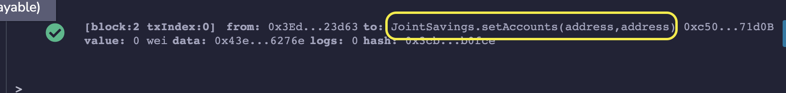
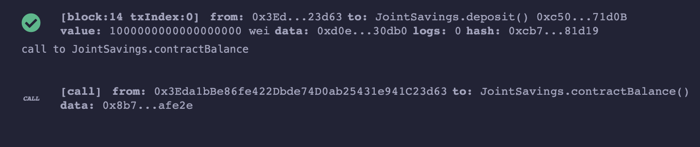
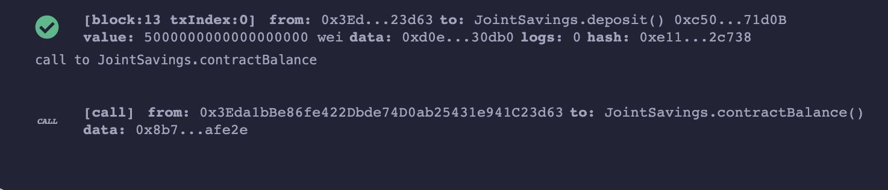
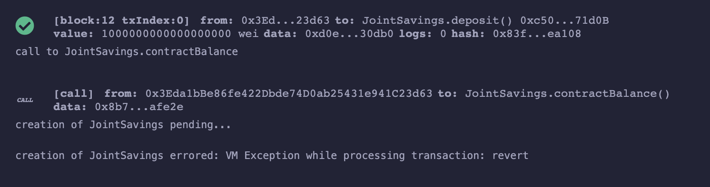
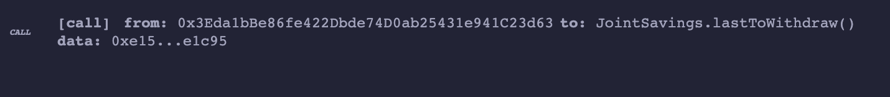
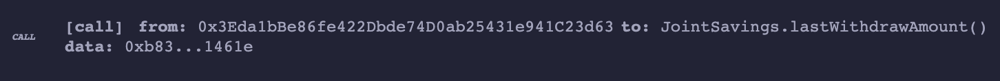

# M20_Joint_Savings

## Background

This is a smart contract which creates a joint savings accounts for two users. Users will be able to deposit, withdraw and check balances of account.

## Technologies
- streamlit
- Remix - Ethereum IDE
- Solidity 

## Installation
First, One must Clone this Repository

Then they must activate their dev environment, Click [here](https://docs.conda.io/projects/conda/en/stable/user-guide/install/macos.html)
for detailed instructions.

## Execututions 
See setAccounts

See deposit 1 Ethereum

See deposit 5 Ethereum

See deposit 10 Ethereum

See lastToWithdraw

See lastWithdraw

## Contributors

Cary Gutknecht, Jay Ferreira, Google, stackOverflow, UC BERKELEY EXTENSION COURSE:FINTECH-MODULE 20

## License
